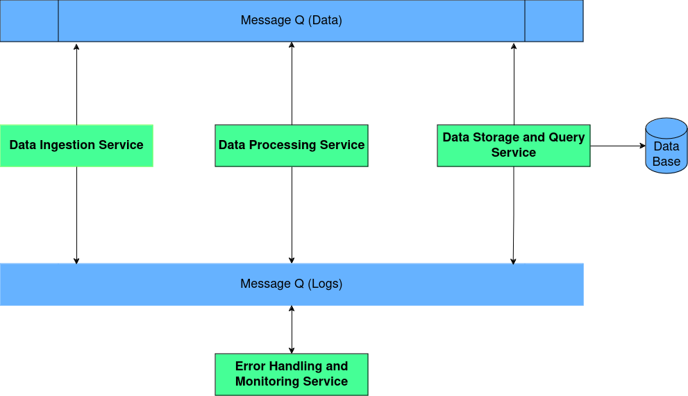

# Data Engineering Framework
This data engineering framework supports various process involved in the data engineering process. It follows microservice architecture and designed keeping scalability and throughput into consideartion.
There are four main services associated with this framework, that are 

  1)Data Ingejction
  
  2)Data preprocessing
  
  3)Data Storage
  
  4)Error handingling and moitoring

## Data Ingejction

## Data preprocessing

## Data Storage

## Error handingling and moitoring
